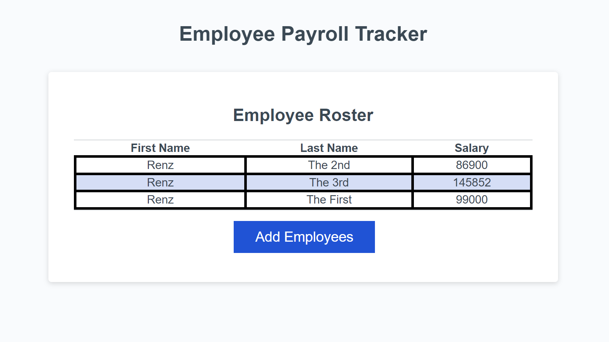
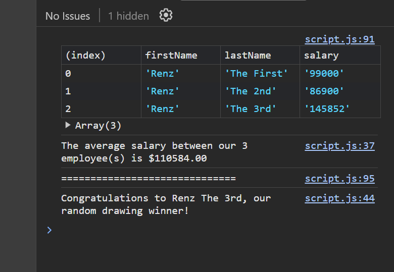
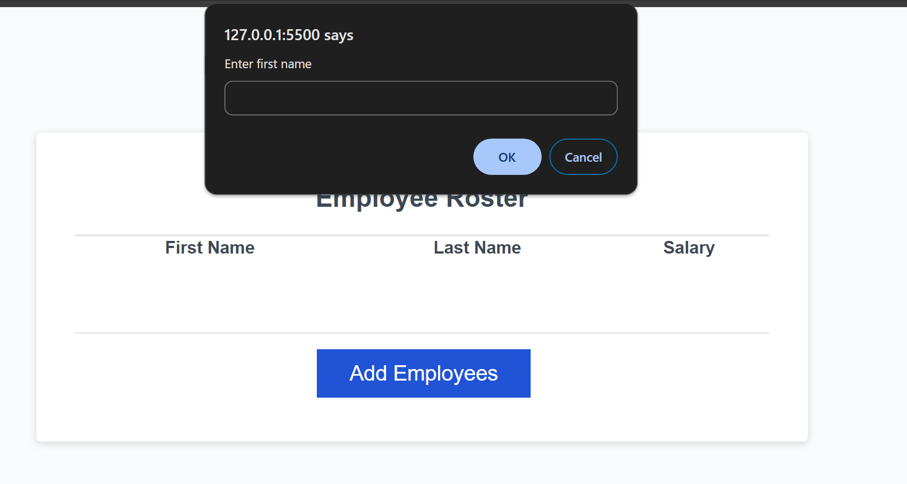

# 03_Javascript_Challenge

## Description

A refactoring javascript challenge that enables a user to input the first name, last name and salary of an employee to be added and displayed in a table.

## Objectives
- To be able to accept inputs using prompts and from those prompts make an employee Javascript Object
- To be able to log into the console a random employee as a simulation of a drawing contest.
- To be able to log the average salary and the number of employees
- To be able to display the details of an employee in a table (first name, last name and salary)

## Screenshots
User Inputs are displayed in a table simulating employees with their salaries, first names and last names

The console displays the table, as well as the winner of the random draw and the average salary and number of employees.

The prompt asks users for the employee's first name, last name and salary and it can be repeated if the user chooses to do so by inputting 'Y' or 'y' after the last prompt of adding more employees.

